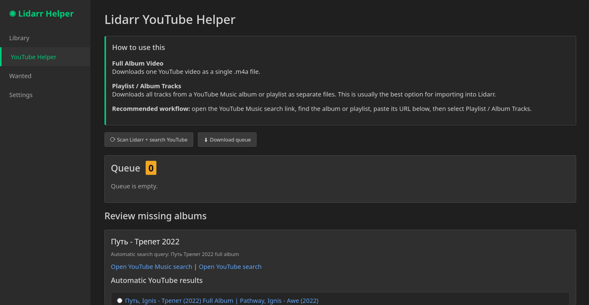
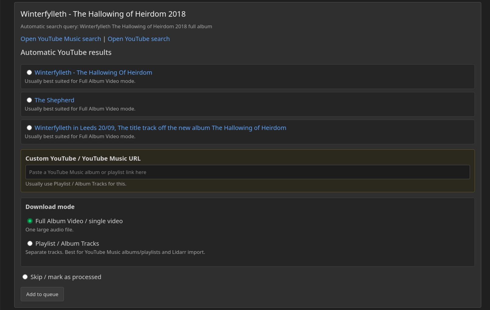

# Lidarr YouTube Helper

A lightweight web application that helps Lidarr users find missing albums on YouTube and YouTube Music, review matches, and download them using yt-dlp.

## Current Features
## v0.2.0-alpha

- Scan Lidarr missing albums
- Review YouTube search results
- Paste custom YouTube Music album URLs
- Queue downloads
- Download full album videos
- Download playlists as separate tracks
- Multi-language UI
- Docker deployment
- Queue management
- Download activity page
- Failed download tracking
- Timestamped download history

## Screenshots




## Requirements

* Docker
* Docker Compose
* Lidarr
* Internet access for YouTube searches

## Installation

Clone the repository:

```bash
git clone https://github.com/MrHymanz/lidarr-youtube-helper.git
cd lidarr-youtube-helper
```

Copy the example environment file:

```bash
cp .env.example .env
```

Edit the configuration:

```bash
nano .env
```

Build and start:

```bash
docker compose up -d --build
```

Open the web interface:

```text
http://SERVER_IP:8999
```

## Configuration

Example:

```env
LIDARR_URL=http://lidarr:8686
LIDARR_API_KEY=YOUR_API_KEY
DOWNLOAD_DIR=/downloads
```

## Usage

### Full Album Video

Downloads a single YouTube video as one audio file.

Recommended when a complete album has been uploaded as a single video.

### Playlist / Album Tracks

Downloads individual tracks from a YouTube Music album or playlist.

Recommended for Lidarr imports.

### Typical Workflow

1. Scan Lidarr missing albums
2. Open the YouTube Music search
3. Find the correct album
4. Paste the album or playlist URL
5. Select Playlist / Album Tracks
6. Add to queue
7. Download queue
8. Import into Lidarr

## Data Storage

The following files are intentionally excluded from Git:

```text
.env
app/cache.json
app/queue.json
app/processed.json
app/settings.json
```

## Roadmap

* Album cover generation
* Lidarr API import integration
* Multi-user support
* Additional languages
* Search quality improvements

## License

MIT License

## Disclaimer

This project does not provide, host, distribute or include copyrighted media.

Users are responsible for complying with the Terms of Service and copyright laws applicable in their jurisdiction.

This project acts only as a helper interface for Lidarr and yt-dlp.
