<p align="center">
  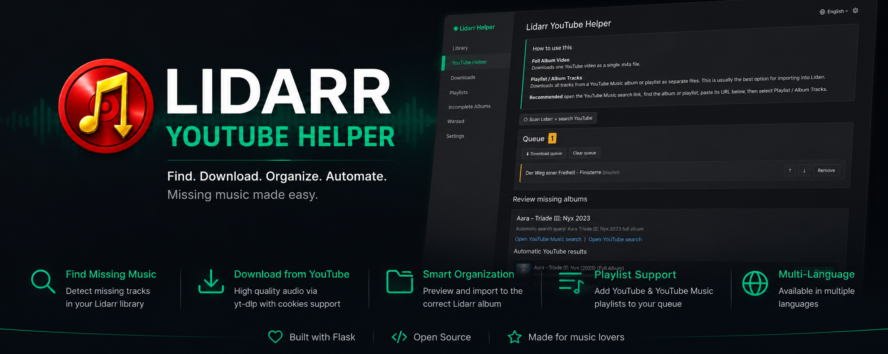
</p>

<p align="center">
  
  
  
  
  
</p>

<p align="center">
A companion application for <b>Lidarr</b> that streamlines discovering, downloading, reviewing and importing music from <b>YouTube</b> and <b>YouTube Music</b>.
</p>
<p align="center">
⭐ Direct Lidarr integration • 🎵 YouTube Music • 🐳 Docker Ready
</p>

---

## Table of Contents

- [Why Lidarr YouTube Helper?](#why-lidarr-youtube-helper)
- [Features](#features)
- [Screenshots](#screenshots)
- [Workflow](#workflow)
- [Installation](#installation)
- [Docker](#docker)
- [Configuration](#configuration)
- [Optional YouTube Cookies](#optional-youtube-cookies)
- [Usage](#usage)
- [FAQ](#faq)
- [Roadmap](#roadmap)
- [Contributing](#contributing)
- [License](#license)
- [Disclaimer](#disclaimer)

---

## Why Lidarr YouTube Helper?

Managing missing albums manually usually means switching between Lidarr,
YouTube, file explorers and metadata editors.

Lidarr YouTube Helper combines those steps into one workflow:

-   Scan missing albums
-   Find music on YouTube / YouTube Music
-   Queue downloads
-   Review metadata
-   Preview imports
-   Import back into Lidarr

---

## Features

### 📚 Library Management
### ⬇️ Download Management
### 📥 Import Workflow
### 🎵 Playlist Support
### 🌍 User Experience
### 🐳 Deployment

## ⬇️ Download Management

-   Download complete album videos
-   Download YouTube Music albums
-   Download playlists
-   Download individual missing tracks
-   Queue management with reordering
-   Playlist download limits
-   Download history
-   Failed download tracking

## 📥 Import Workflow

-   Import Preview
-   Automatic target folder detection
-   Existing track detection
-   Safe replacement workflow
-   Metadata normalization
-   Metadata review
-   Refresh artist in Lidarr after import

## 🎵 Playlist Support

-   Save playlists
-   Queue playlists
-   Queue all playlists
-   Automatic playlist title detection
-   Configurable limits

## 🌍 User Experience

-   Responsive interface
-   Multi-language support
-   Settings page
-   Optional YouTube cookie authentication

## 🐳 Deployment

-   Docker
-   Flask
-   Environment-based configuration
-   Automatic Deno installation

---

## Screenshots

### Dashboard
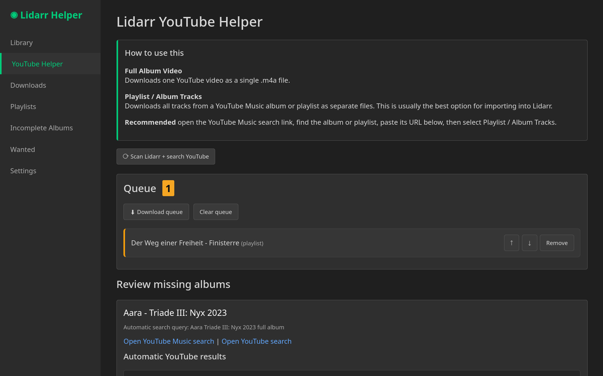

### Missing Albums
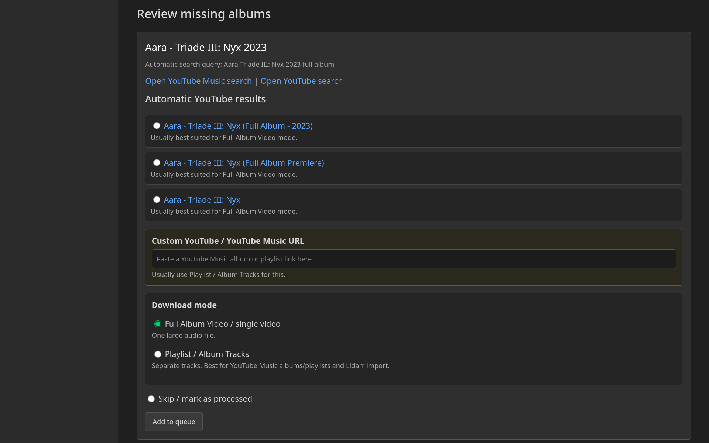

### Downloads

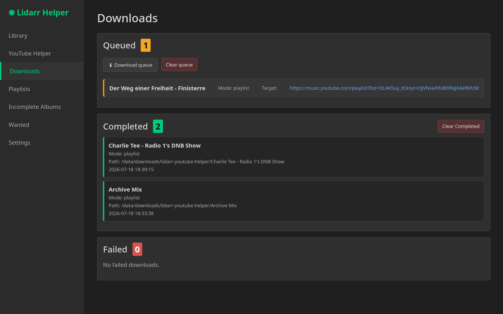

### Failed Downloads

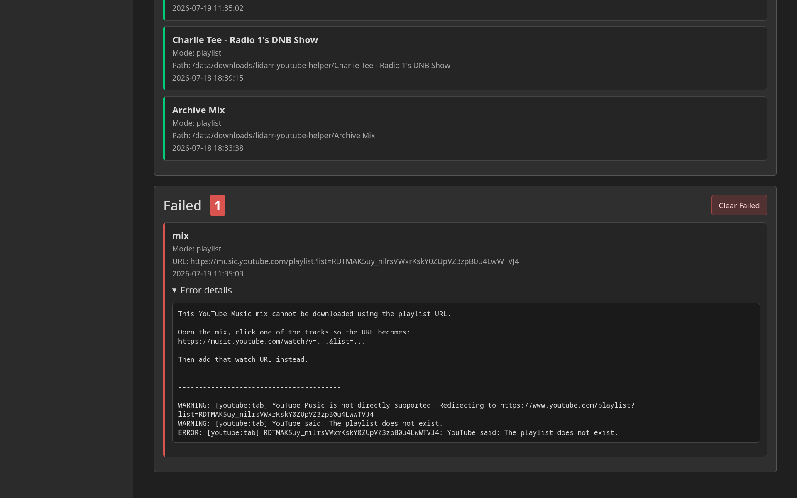

### Album Details

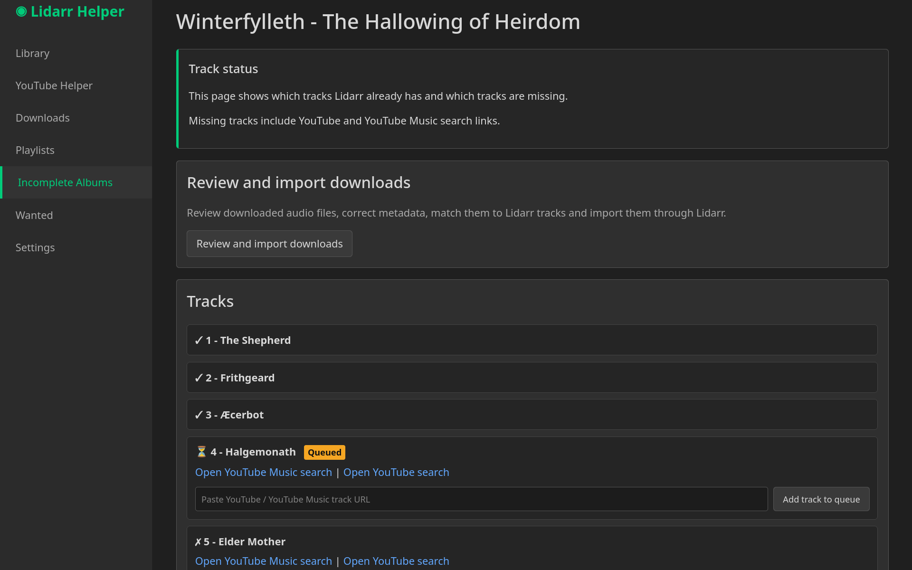

### Incomplete Albums

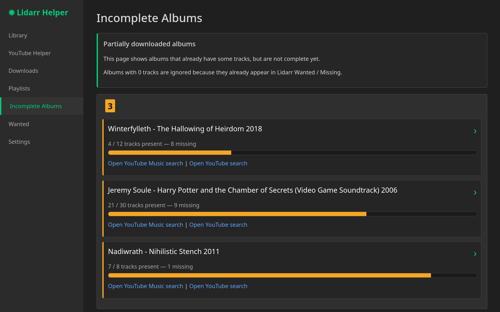

### Playlist Manager

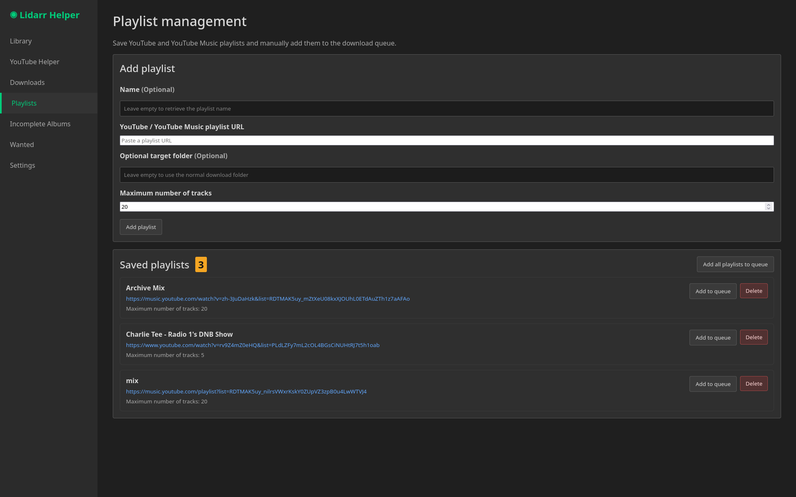

### Import Preview

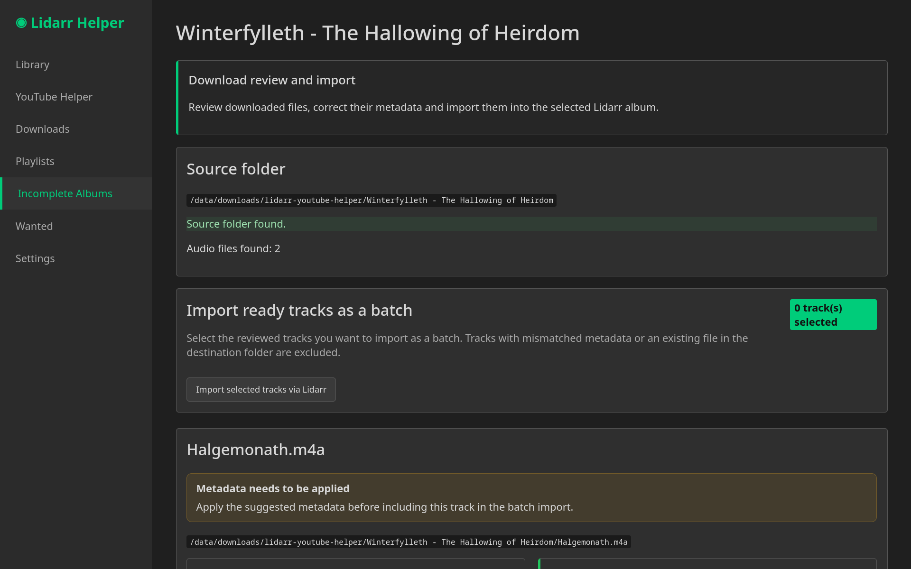

### Metadata Review

Before

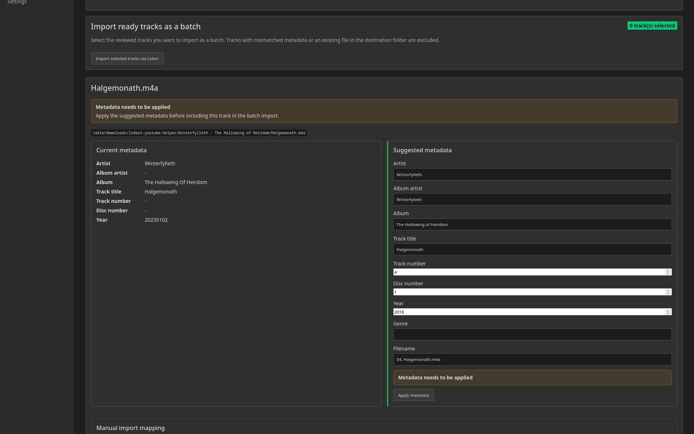

After

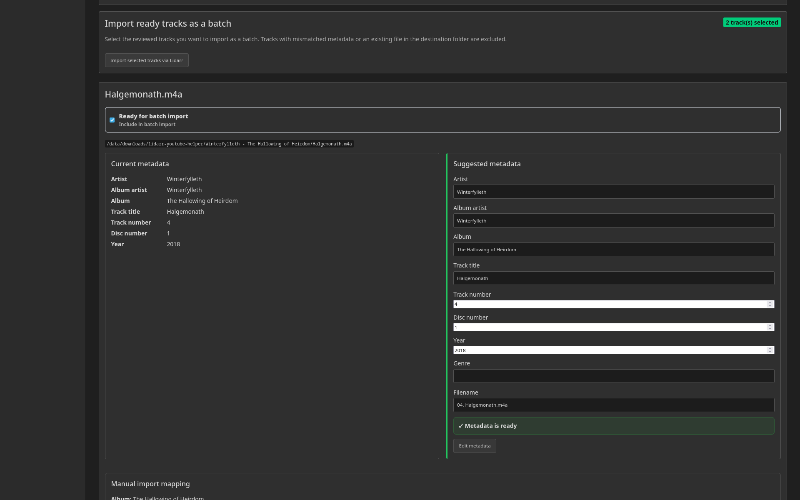

### Languages

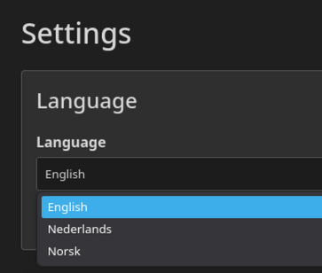

### Settings

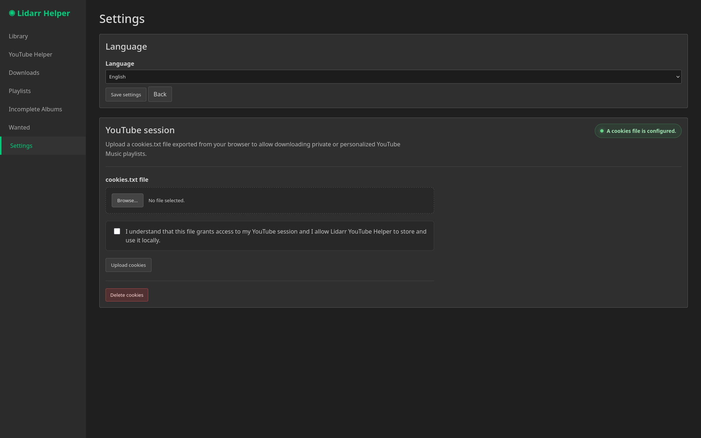

### Workflow

```text
Lidarr
  │
Scan Missing Albums
  │
Album Details
  │
Search YouTube / YouTube Music
  │
Queue Album / Playlist / Missing Tracks
  │
Download
  │
Import Preview
  │
Metadata Review
  │
Import into Lidarr
  │
Refresh Artist
```

---

## Installation

```bash
git clone https://github.com/MrHymanz/lidarr-youtube-helper.git
cd lidarr-youtube-helper
cp .env.example .env
```

Configure:

```env
LIDARR_URL=http://lidarr:8686
LIDARR_API_KEY=YOUR_API_KEY
DOWNLOAD_DIR=/data/downloads/lidarr-youtube-helper
FLASK_SECRET_KEY=CHANGE_ME
YOUTUBE_COOKIES_FILE=/config/secrets/youtube-cookies.txt
```

Run:

``` bash
docker compose up -d --build
```

Open your browser:

```text
http://SERVER_IP:8999
```

---

## Docker

The application runs completely inside Docker.

Mounted directories:

-   `/data/media/music`
-   `/data/downloads`
-   `./config`
-   `./app`

Modern versions of **yt-dlp** require a JavaScript runtime. The
container installs **Deno** automatically.

---

## Configuration

| Variable | Description |
|----------|-------------|
| LIDARR_URL | Lidarr server URL |
| LIDARR_API_KEY | Lidarr API key |
| DOWNLOAD_DIR | Staging download directory |
| FLASK_SECRET_KEY | Flask session secret |
| YOUTUBE_COOKIES_FILE | Optional cookies file |

---

## Optional YouTube Cookies

Cookies improve compatibility with:

-   YouTube Music
-   Age restricted videos
-   Some authenticated playlists
-   Rate limiting

Upload cookies through **Settings**.

---

## Usage

1.  Scan Lidarr
2.  Open Album Details
3.  Search YouTube
4.  Queue album / playlist / tracks
5.  Download
6.  Review Import Preview
7.  Adjust metadata
8.  Import into Lidarr

---

## FAQ

### Does this replace Lidarr?

No. It extends Lidarr.

### Does it support YouTube Music?

Yes.

### Are cookies required?

No.

### Does it automatically import into Lidarr?

Not yet. Import assistance is implemented; further automation is
planned.

---

## Roadmap

-   Automatic Lidarr imports
-   Duplicate detection improvements
-   Smarter YouTube matching
-   Better artwork handling
-   More metadata providers
-   Additional languages
-   Release packages
-   GitHub Actions

---

## Contributing

Bug reports, feature requests and pull requests are welcome.

Please open an issue before implementing major changes.

---

## License

MIT License.

---

## Disclaimer

This project does not host or distribute copyrighted material.

Users remain responsible for complying with copyright law and the Terms
of Service of YouTube and YouTube Music.

This project acts solely as a companion application for Lidarr and
yt-dlp.